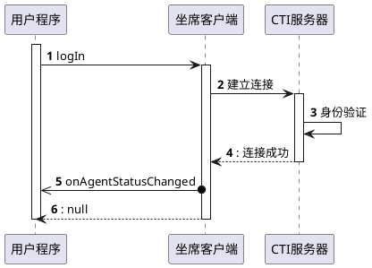

# JSONRPC

座席程序的对外可编程接口采用 _JSONRPC over Websocket_ 的形式。
它的 RPC 传送协议大体上遵照 _[JSON-RPC 2.0 Specification](https://www.jsonrpc.org/specification)_ 的定义[^1]。

在本文的后续部分，我们将使用类似面向过程语言的函数定义形式，说明 API 接口。

本节针对各种常见的调用方式作出说明，更多信息请参考 <https://www.jsonrpc.org/specification> 。

## 方法调用举例

此处以登录方法为例：座席程序提供了方法 `logIn`，调用后将连接并登录到 CTI 服务器。

座席客户端程序中，这个 RPC 的实现可以用下面的伪代码表示：

```js
function logIn(workerNum, password) {
    console.log("开始连接服务器");
    connectServer(getAddress(), workerNum, password)
        .then(() => {
            console.log("连接成功");
            return {
                id: getRpcId(),
                result: null,
            };
        })
        .catch((e) => {
            console.error("连接失败");
            return {
                id: getRpcId(),
                error: { code: e.code, message: e.message },
            };
        });
}
```

座席收到 RPC 请求后，按照方法名调用内部的函数。如果执行成功，返回执行结果；如果失败；则返回失败数据。

-   在本文档中，我们这样撰写 RPC 的说明:

    {>>
    在 Method 标题下，记录方法的名称，和简要说明

    例如：
    <<}

    -   **Method**: `logIn`

    {>>
    在 Params 标题下，记录参数列表及其相关说明

    例如：
    <<}

    -   **Params**:

        | Argument    | Data Type | Default | Description |
        | ----------- | --------- | ------- | ----------- |
        | `workerNum` | `String`  | -       | 登录工号    |
        | `password`  | `String`  | -       | 登录密码    |

        请求部分的 JSON 的写法可以是以下例中的任一:

        -   顺序参数写法(`params`是数组):

            ```json
            {
                "jsonrpc": "2.0",
                "id": "<your-rpc-id>",
                "method": "logIn",
                "params": ["1000", "rx19fED*^&gbiqw2"]
            }
            ```

        -   命名参数写法(`params`是对象):

            ```json
            {
                "jsonrpc": "2.0",
                "id": "<your-rpc-id>",
                "method": "logIn",
                "params": {
                    "workerNum": "1000",
                    "password": "rx19fED*^&gbiqw2"
                }
            }
            ```

    {>>
    在 Result 标题下，记录返回值及其相关说明

    例如：
    <<}

    -   **Result**: `null`

        没有返回值，但受限于 JSONRPC 规定，此处统一返回 `null`。

        回复数据的 JSON 格式形如:

        ```json
        { "jsonrpc": "2.0", "id": "<your-rpc-id>", "result": null }
        ```

-   下面的时序图表现了调用 `logIn` 成功登录的情况:

    ```plantuml
    @startuml

    autonumber

    activate 用户程序
    用户程序 -> 坐席客户端: logIn
    activate 坐席客户端
    坐席客户端 -> CTI服务器: 建立连接
    activate CTI服务器
    CTI服务器 -> CTI服务器: 身份验证
    return: 连接成功
    return: null
    deactivate 用户程序

    @enduml
    ```

-   建立 WebSocket 连接，调用登录方法，并输出返回结果的 HTML 代码片段如下:

    ```html
    <button id="btnLogIn">点击按钮登录</button>

    <script>
        // 全局 WebSocket 对象
        const sock = new WebSocket("ws://localhost:9696/jsonrpc");

        // 输出收到的 Response
        sock.onmessage = (event) => {
            let res = JSON.parse(event.data);
            if ("result" in res) {
                console.log("Invoke 成功");
            } else if ("error" in res) {
                console.error("Invoke 失败");
            }
        };

        // 点击按钮登录
        document.getElementById("btnLogIn").addEventListener("click", () => {
            console.log("登录 ...");
            socket.send(
                JSON.stringify({
                    jsonrpc: "2.0",
                    id: 1,
                    method: "logIn",
                    params: ["1001", "1001abcd"],
                })
            );
        });
    </script>
    ```

## 事件通知举例

我们以座席状态变化事件举例：当登录成功后，座席状态会发生变化，座席程序会把状态变化事件以 JSONRPC 的形式通知给与它相连的 WebSocket 客户端。

座席客户端发出的事件通知相当于反向的 RPC，且消息的 JSON 对象没有 `id` 属性，不需要回复。

我们用类似方法调用文档的形式描述它:

-   **Method**: `onAgentStatusChanged`

    登录、注销，签入、签出技能组，示闲、示忙，来电接听等操作均可导致座席状态的改变。

    这个事件将会把新的状态作为参数送出。

-   **Params**:

    | Argument     | Type      | Default | Description         |
    | ------------ | --------- | ------- | ------------------- |
    | `agentState` | `Integer` | -       | [座席状态][] 枚举值 |
    | `workType`   | `Integer` | -       | [工作类型][] 枚举值 |

这个事件的 JSON 数据形如：

```json
{
    "jsonrpc": "2.0",
    "method": "onAgentStatusChanged",
    "params": [0, 0]
}
```

WebSocket 客户端不应回复这个通知消息。

登录时，一旦 `logIn` 调用成功， `onAgentStatusChanged` 事件就会被触发。
这个过程可以用下面的时序图表示：



!!! note
`logIn` 的回复和 `onAgentStatusChanged` 事件通知**没有**时序性。
也就是说，它们之中，哪个消息先被收到是不确定的。

现在，我们可以补充上一个小节的 HTML 代码片段，把这个事件的处理加上:

```html
<button id="btnLogIn">点击按钮登录</button>

<script>
    // 全局 WebSocket 对象
    const sock = new WebSocket("ws://localhost:9696/jsonrpc");

    // 输出收到的 Response
    sock.onmessage = (event) => {
        let res = JSON.parse(event.data);
        if ("result" in res) {
            console.log("Invoke 成功");
        } else if ("error" in res) {
            console.error("Invoke 失败");
        } else if ("method" in res && !("id" in res)) {
            console.log(`Event: ${res}`);
        }
    };

    // 点击按钮登录
    document.getElementById("btnLogIn").addEventListener("click", () => {
        console.log("登录 ...");
        socket.send(
            JSON.stringify({
                jsonrpc: "2.0",
                id: 1,
                method: "logIn",
                params: ["1001", "1001abcd"],
            })
        );
    });
</script>
```

[^1]: 座席程序的 RPC 接口基本支持常见的 JSONRPC 使用方式，但是有所限制:

    -   不支持 [`Batch`](https://www.jsonrpc.org/specification#batch) 方式
    -   在一个 RPC 完成之前，不接受新的请求

[座席状态]: ../enums/agent_state.md
[工作类型]: ../enums/agent_work_type.md

--8<-- "src/docs/includes/glossary.md"
