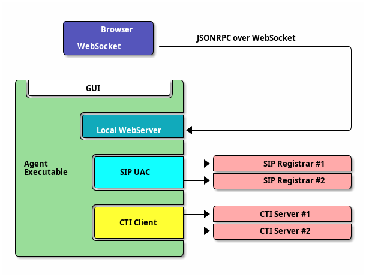

# 介绍

IPSC 座席客户端软件 （以下常简称为“座席”、“座席软件”） 是 IPSC 这个呼叫中心中间件服务器的桌面客户端软件，它供客服人员使用。

座席软件是“工具条”样式的 Windows 桌面程序，它为客服人员提供了完备的功能，如登录、注销、签入、牵出、接听、呼叫、监听、多方、转移等。

与此同时，座席客户端通过程序内部嵌入了一个桌面级别的轻量级 Web 服务器，提供编程接口。

开发人员可以通过调用 WebAPI，“遥控”座席客户端程序进行登录、注销，呼叫、接听等动作，或者从座席客户端程序获取来电信息、排队列表等数据。

下图描绘了座席程序大致的内部结构，以及连接双服务器，对接浏览器程序的使用场景。

!!! note
    请注意浏览器与座席程序之间的连线:

    - 座席程序在 `localhost` 打开端口进行监听，提供 WebService
    - 浏览器和座席程序之间通过 JSON RPC over WebSocket 进行通信

    **这是座席程序唯一的可编程控制方式。**
