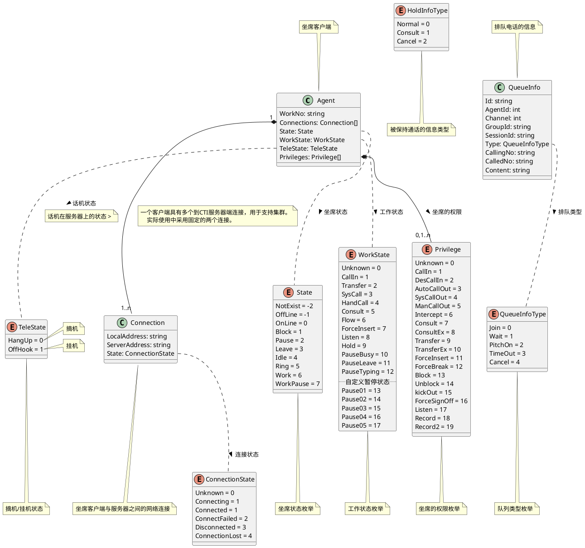

# Data Models

```puml
@startuml

class Agent {
    WorkNo: string
    Connections: Connection[]
    State: State
    WorkState: WorkState
    TeleState: TeleState
    Privileges: Privilege[]
}
note top: 坐席客户端

class Connection {
    LocalAddress: string
    ServerAddress: string
    State: ConnectionState
}
note bottom: 坐席客户端与服务器之间的网络连接

enum ConnectionState{
    Unknown = 0
    Connecting = 1
    Connected = 1
    ConnectFailed = 2
    Disconnected = 3
    ConnectionLost = 4
}

enum State {
    NotExist = -2
    OffLine = -1
    OnLine = 0
    Block = 1
    Pause = 2
    Leave = 3
    Idle = 4
    Ring = 5
    Work = 6
    WorkPause = 7
}
note bottom: 坐席状态枚举

enum WorkState {
    Unknown = 0
    CallIn = 1
    Transfer = 2
    SysCall = 3
    HandCall = 4
    Consult = 5
    Flow = 6
    ForceInsert = 7
    Listen = 8
    Hold = 9
    PauseBusy = 10
    PauseLeave = 11
    PauseTyping = 12
    .. 自定义暂停状态 ..
    Pause01 = 13
    Pause02 = 14
    Pause03 = 15
    Pause04 = 16
    Pause05 = 17
}
note bottom: 工作状态枚举

enum HoldInfoType { 
    Normal = 0
    Consult = 1
    Cancel = 2
}
note bottom: 被保持通话的信息类型

enum QueueInfoType {
    Join = 0
    Wait = 1
    PitchOn = 2
    TimeOut = 3
    Cancel = 4
}
note bottom: 队列类型枚举

enum TeleState {
    HangUp = 0
    OffHook = 1
}
note bottom: 摘机/挂机状态
note right of TeleState::HangUp
    摘机
endnote
note right of TeleState::OffHook
    挂机
endnote

enum Privilege {
    Unknown = 0
    CallIn = 1
    DesCallIn = 2
    AutoCallOut = 3
    SysCallOut = 4
    ManCallOut = 5
    Intercept = 6
    Consult = 7
    ConsultEx = 8
    Transfer = 9
    TransferEx = 10
    ForceInsert = 11
    ForceBreak = 12
    Block = 13
    Unblock = 14
    kickOut = 15
    ForceSignOff = 16
    Listen = 17
    Record = 18
    Record2 = 19
}
note bottom: 坐席的权限枚举

class QueueInfo {
    Id: string
    AgentId: int
    Channel: int
    GroupId: string
    SessionId: string
    Type: QueueInfoType
    CallingNo: string
    CalledNo: string
    Content: string    
}
note top: 排队电话的信息

Agent::Connections "1" *-- "1..n" Connection: ""
    note on link:\
    一个客户端具有多个到CTI服务器端连接，用于支持集群。\n\
    实际使用中采用固定的两个连接。

Agent::State .. State: 坐席状态 >
Agent::TeleState .. TeleState: 话机状态 >
    note on link: 话机在服务器上的状态 >
Agent::Privileges "1" *-- "0,1..n" Privilege: 坐席的权限 >
Agent::WorkState .. WorkState: 工作状态 >

Connection::State .. ConnectionState: 连接状态 >

QueueInfo::Type .. QueueInfoType: 排队类型 >

@enduml
```
